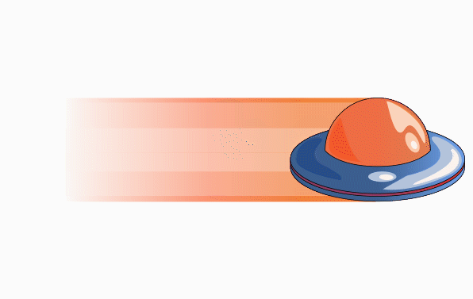
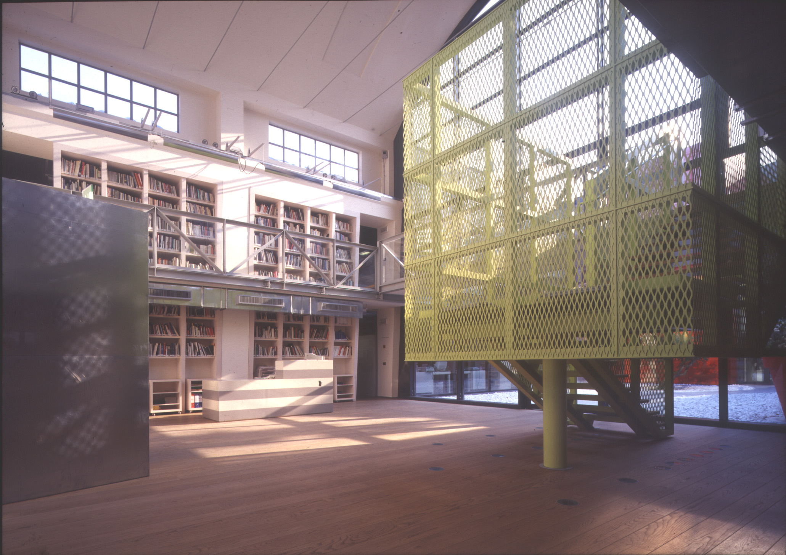

HYP is an App designed and developed by four students at [Scuola Mohole](https://scuola.mohole.it)

(ᵔᴥᵔ) (ᵔᴥᵔ) (ᵔᴥᵔ) (ᵔᴥᵔ) 

## Goals of the project “φʕ•ᴥ•oʔ
Dopo aver notato delle mancanze da parte del servizio utilizzato dalla scuola come gestionale delle attività scolastiche ci siamo messi in gioco per creare un applicazione per avvicinare le informazioni, attività, novita della scuola allo studente medio 

Il risultato è una PWA. 
Il risultato finale è un prototipo, necessita fondi per essere migliorato

## Getting starter
### Visit WebSite ~ Download PWA
il sito è online tramite Netlify al link ==> [Happy Beaver](https://happy-beaver-hyp.netlify.com/)

(ᵔᴥᵔ)

### Migliorare HYP

```sh
git clone …. 
cd hyp …. 
npm install
npm start
```
...and the magic happens ( ◔ ౪◔)⊃━☆ﾟ.*・

## Tecnologie usate

Per questo progetto siamo stati piacevolmente sfidati ad usare **REACT** e **STRAPI**.

**REACT** è un **_libreria_**  Javascript pensata per la realizzazione di User Interfaces mentre **STRAPI** viene utilizzato per lo sviluppo backend.

Di seguito lasciamo i link alle loro documentazione:

**[REACT](https://reactjs.org/)** <br/>
**[STRAPI](https://strapi.io/)**


## perché wp-api
pressoché imposto...
### come collegare wp-api
link al github di Caterina

## perche HYP2
ci fù HYP,
falli,
ora c'é HYP2

## requiremnts
node.js
account strapi 

## Graphics stuff
### Font
```sh
$font-title: 'Baloo Bhai',cursive;
$font-text: 'Open Sans', sans-serif;
```
### pattern
```sh

$colors: ('web': (start: rgba(39, 14, 122, 1),
    end: rgba(184, 14, 122, 1),
    angle: 30deg),
  'acting': (start:  rgba(178, 103, 136, 1) ,
    end: rgba(255, 103, 160, 1),
    angle: 30deg),
  'fotografia': (start:  rgba(49, 172, 228, 1),
    end: rgba(142, 152, 228, 1),
    angle: 30deg),
  'storytelling': (start:  rgba(246, 109, 155, 1),
    end: rgba(211, 156, 228, 1),
    angle: 30deg),
  'filmaking': (start: rgba(79, 221, 160, 1),
    end:rgba(181,
    255, 168, 1),
    angle: 30deg),
  'fumetto': (start: rgba(39, 14, 122, 1),
    end: rgba(184, 14, 122, 1),
    angle: 30deg),
  '3d': (start: rgba(39, 14, 122, 1),
    end: rgba(184, 14, 122, 1),
    angle: 30deg),
  'grafica': (start: #ff2915,
    end: #ffdd47,
    angle: 30deg),
);
```

### Animation


## si ringrazia
Mohole
